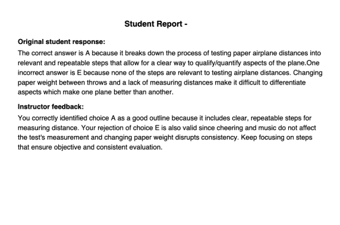
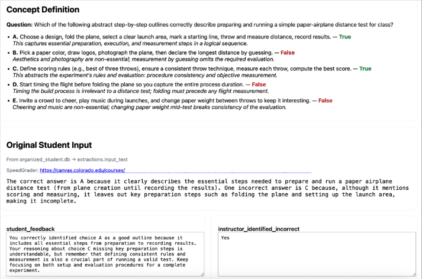
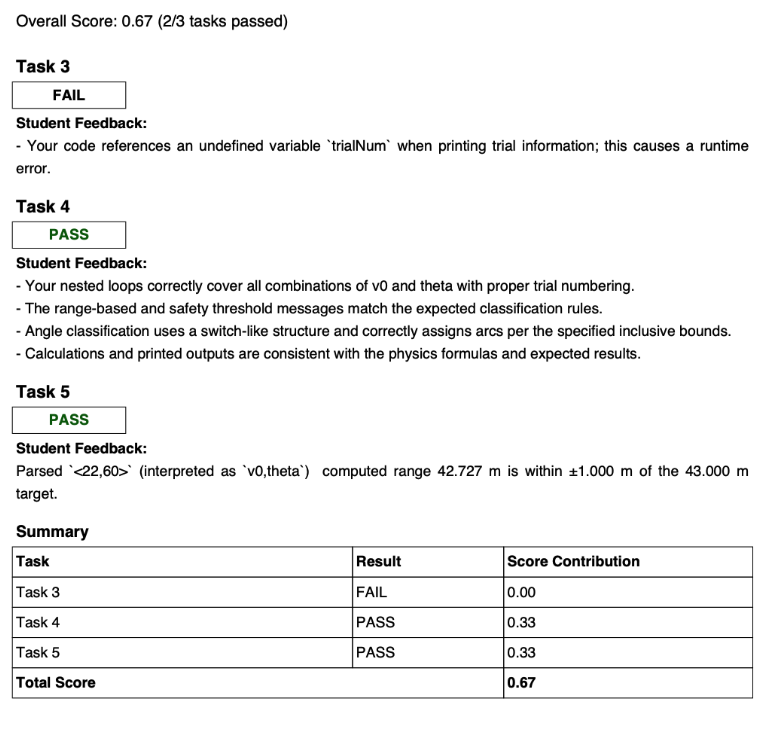
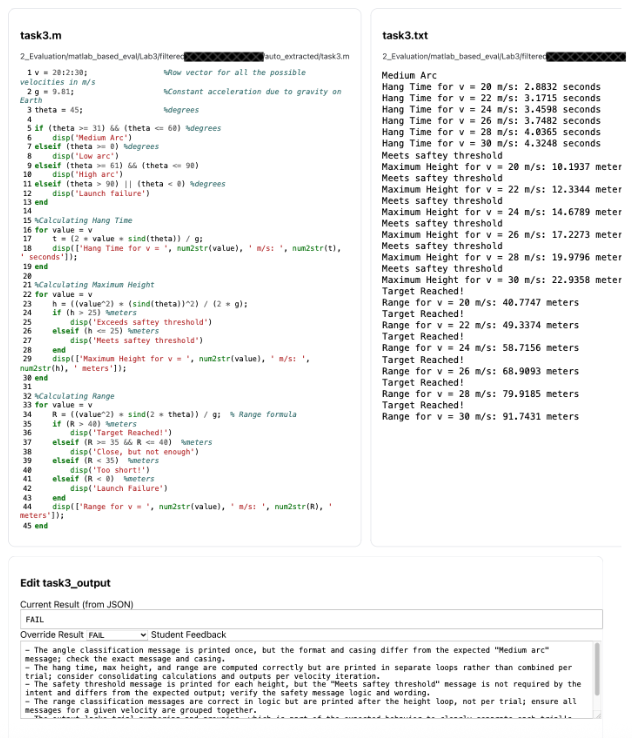

# AI-Augmented Personalized Feedback

## Project Summary

The AI-Augmented Personalized Feedback project focuses on using AI systems to support instructors in delivering individualized, formative feedback across a range of student submissions, including concept inventories, lab reports, and open-ended responses. Built on the BUFFALO framework (Bot-Based Understanding via Futuristic Focused AI Learning Opportunities), this project emphasizes understanding, reflection, and conceptual growth rather than automated scoring.

This work directly supports the BOBPE mission by enabling scalable personalization while preserving instructor oversight and pedagogical intent.

---

## Educational Problem Addressed

Providing meaningful, individualized feedback is one of the most impactful instructional practices, yet it is also one of the most difficult to scale. In large courses, instructors are often forced to choose between depth of feedback and timely response, limiting students’ opportunities to reflect and improve.

As a result, feedback is frequently reduced to brief comments or numerical scores that do not adequately support learning or conceptual change.

---

## How AI Is Used

AI is used to:
- Analyze open-ended student responses and submissions
- Generate draft formative feedback aligned with learning objectives
- Identify patterns of understanding and misunderstanding
- Support reflective prompts and follow-up questions
- Assist instructors in synthesizing individual and group-level insights

AI outputs are designed to inform and augment instructor feedback, not replace it.

---

## Instructor Experience

Instructors interact with the system through interfaces that:
- Display student submissions alongside AI-generated feedback
- Allow direct editing and refinement of AI suggestions
- Support consistent application of instructional criteria
- Surface trends across students or groups

This human-in-the-loop workflow ensures that feedback remains accurate, contextualized, and pedagogically aligned.

---

## Student Experience

From the student perspective, feedback is:
- Timely and personalized
- Focused on conceptual understanding rather than correctness alone
- Framed to encourage reflection and self-explanation
- Consistent across assignments and evaluators

Students receive clearer guidance on *why* their reasoning is effective or flawed, supporting deeper learning.

---

## Example Applications

- Concept quiz reports highlighting individual misconceptions
- Lab report feedback emphasizing interpretation and reasoning
- Open-ended assignments with structured, criterion-based feedback
- Group-level summaries identifying common challenges

---

## Deployment Status

**Status:** Active classroom use / Research-informed development  
The system has been used in instructional contexts and continues to evolve as part of ongoing research into scalable feedback and AI-supported learning.

## Artifacts and Links

### Concept Report Example

This image shows a typical student evaluation report that is automatically generated and returned as a PDF. Each report includes the student’s original response alongside AI-augmented, instructor-reviewed feedback. Feedback is personalized to each student’s short-answer response and includes targeted explanations as well as encouraging guidance, supporting reflection and conceptual understanding.

---

### Concept Assessment Grader Interface

This image shows the human grader interface for weekly concept quizzes. The question and answer key are displayed at the top, followed by the student’s verbatim response and a direct link to their Canvas submission. The student_feedback field is fully editable, allowing graders to quickly review and refine AI-generated feedback before proceeding.

During the Fall 2025 semester, nearly 80% of AI-generated feedback was released unchanged after human review, with the remaining responses requiring only minor edits. Overall, grader effort translated to an effective feedback rate exceeding 80 words per minute, enabling high-quality personalized feedback with professional typist speed.

---

### Lab Report Feedback Example

This image shows a sample lab report feedback form provided to students. The report includes pass/fail evaluations for rubric components along with detailed, personalized feedback on code structure, logic, and clarity. This approach enables the instructional team to assess not only code output but also the quality and organization of student-written code—something that is typically impractical to evaluate consistently in large-scale programming courses.

---

### Instructor Review Interface

This image shows the code review grading interface used for programming-based assignments. The student’s submitted code is displayed alongside the program output, with AI-augmented feedback provided below. Both the feedback and pass/fail determinations are fully editable by the grader. This interface allows instructional staff to efficiently evaluate code correctness, execution, and structure within a single, integrated view.

## Alignment with BOBPE Mission

This project exemplifies the core BOBPE goal of scalable personalized education by enabling individualized feedback without increasing instructor workload. By focusing on understanding, reflection, and instructor oversight, it demonstrates how AI can enhance feedback practices while remaining grounded in learning science and human judgment.
